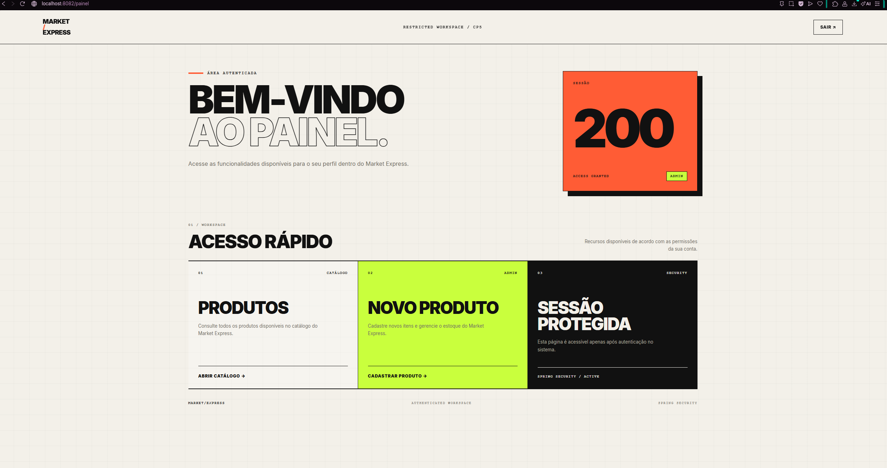

# Market Express

Aplicação web desenvolvida para o **Checkpoint 5 - Parte I** da FIAP, com foco em **Spring Security MVC, controle de acesso, persistência em banco de dados e deploy**.

O projeto permite visualizar e gerenciar produtos de um mercado express utilizando **Spring Boot, Spring MVC, Thymeleaf, Spring Security, OAuth2 e Oracle Database**, mantendo também a API REST com HATEOAS desenvolvida nas etapas anteriores.

---

## Deploy

Aplicação publicada no **Render**:

- **Landing Page:** https://java-cp4-5vb8.onrender.com/
- **Painel autenticado:** https://java-cp4-5vb8.onrender.com/painel
- **Catálogo:** https://java-cp4-5vb8.onrender.com/itens
- **Login:** https://java-cp4-5vb8.onrender.com/login
- **API REST:** https://java-cp4-5vb8.onrender.com/mercado

> No primeiro acesso, o Render pode levar alguns segundos para inicializar a aplicação.

### Repositório

- **GitHub:** https://github.com/gugomesx10/java-cp5-parte1

---

## Funcionalidades

- Landing page pública
- Catálogo público de produtos
- Painel restrito para usuários autenticados
- Cadastro de usuários locais
- Login tradicional com usuário e senha
- Login social com GitHub via OAuth2
- Login e logout
- Controle de acesso por perfil
- Perfis `USER` e `ADMIN`
- CRUD completo de produtos
- Persistência com Oracle Database
- Interface web com Thymeleaf
- API REST
- HATEOAS
- Tratamento de acesso negado
- Deploy com Docker e Render

### Perfis de acesso

| Perfil | Landing | Catálogo | Painel | Cadastrar | Editar | Excluir |
|---|:---:|:---:|:---:|:---:|:---:|:---:|
| Visitante | ✅ | ✅ | ❌ | ❌ | ❌ | ❌ |
| USER | ✅ | ✅ | ✅ | ❌ | ❌ | ❌ |
| ADMIN | ✅ | ✅ | ✅ | ✅ | ✅ | ✅ |

Usuários cadastrados pelo próprio sistema recebem automaticamente o perfil `USER`.

Usuários autenticados pelo GitHub também recebem `ROLE_USER`.

As operações de criação, edição e exclusão são restritas ao perfil `ADMIN`.

---

## Tecnologias

- Java 17
- Spring Boot 4.1
- Spring MVC
- Spring Security
- Spring Security OAuth2 Client
- Spring Data JPA
- Spring HATEOAS
- Thymeleaf
- Thymeleaf Extras Spring Security
- Hibernate
- Oracle Database
- Lombok
- Maven
- Docker
- Render
- Postman
- Git
- GitHub
- IntelliJ IDEA

---

## Arquitetura

O projeto utiliza separação de responsabilidades em camadas:

```text
Controller
    ↓
Service
    ↓
Repository
    ↓
Oracle Database
```

Estrutura principal:

```text
src/main/java/br/com/fiap/market

├── config
├── controller
├── dto
├── entity
├── enums
├── exception
├── handler
├── repository
├── service
└── MarketApplication.java
```

A autenticação social utiliza um serviço próprio:

```text
GitHub
   ↓
Spring Security OAuth2
   ↓
OAuth2UsuarioService
   ↓
UsuarioRepository
   ↓
Oracle Database
```

---

## Interface Web

Principais rotas MVC:

| Método | Endpoint | Acesso | Descrição |
|---|---|---|---|
| GET | `/` | Público | Landing page do sistema |
| GET | `/login` | Público | Tela personalizada de login |
| GET | `/cadastro` | Público | Cadastro de usuário |
| POST | `/cadastro` | Público | Registra usuário local |
| GET | `/painel` | Autenticado | Área restrita após o login |
| GET | `/itens` | Público | Lista os produtos |
| GET | `/itens/novo` | ADMIN | Formulário de cadastro |
| POST | `/itens` | ADMIN | Cadastra produto |
| GET | `/itens/{id}/editar` | ADMIN | Formulário de edição |
| PUT | `/itens/{id}/editar` | ADMIN | Atualiza produto |
| DELETE | `/itens/{id}/excluir` | ADMIN | Exclui produto |

Após autenticação por formulário ou GitHub, o usuário é redirecionado para:

```text
/painel
```

A rota `/painel` exige autenticação.

---

## Autenticação

O sistema possui dois fluxos de autenticação para usuários.

### Usuário LOCAL

O usuário criado pela própria aplicação é persistido no banco com:

```text
PROVIDER = LOCAL
ROLE = USER
SENHA = BCrypt
PROVIDER_ID = null
AVATAR_URL = null
```

A autenticação por formulário busca apenas usuários com:

```text
AuthProvider.LOCAL
```

Essa separação impede que contas OAuth2 sejam utilizadas no formulário tradicional de usuário e senha.

---

### GitHub OAuth2

O login social com GitHub é iniciado através da rota:

```text
/oauth2/authorization/github
```

Após a autenticação no GitHub, o usuário retorna para:

```text
/login/oauth2/code/github
```

A conta é persistida utilizando o identificador fornecido pelo GitHub:

```text
PROVIDER = GITHUB
PROVIDER_ID = ID da conta GitHub
ROLE = USER
SENHA = null
AVATAR_URL = URL do avatar
```

O identificador do provedor é utilizado para localizar a conta nos próximos logins, evitando a criação de usuários duplicados.

O `OAuth2UsuarioService` também adiciona:

```text
ROLE_USER
```

às authorities da sessão OAuth2.

---

### ADMIN

O usuário administrativo é configurado através de variáveis de ambiente.

Ele recebe:

```text
ROLE_ADMIN
```

O perfil `ADMIN` possui acesso às operações administrativas do CRUD.

---

## API REST

A API REST foi mantida e utiliza os mesmos dados da interface MVC.

| Método | Endpoint | Acesso | Descrição |
|---|---|---|---|
| GET | `/mercado` | Público | Lista os produtos |
| GET | `/mercado/{id}` | Público | Busca produto por ID |
| POST | `/mercado` | ADMIN | Cadastra produto |
| PUT | `/mercado/{id}` | ADMIN | Atualização completa |
| PATCH | `/mercado/{id}` | ADMIN | Atualização parcial |
| DELETE | `/mercado/{id}` | ADMIN | Exclui produto |

Exemplo de resposta:

```json
{
  "id": 1,
  "nome": "Arroz Branco",
  "tipo": "Alimento",
  "setor": "Mercearia",
  "tamanho": "5kg",
  "preco": 28.99,
  "_links": {
    "self": {
      "href": "/mercado/1"
    },
    "mercado": {
      "href": "/mercado"
    }
  }
}
```

As respostas utilizam **Spring HATEOAS**, adicionando links relacionados aos recursos disponíveis.

---

## Banco de Dados

A aplicação utiliza **Oracle Database** com Spring Data JPA e Hibernate.

Principais tabelas:

```text
TDS_TB_MERCADO
TDS_TB_USUARIO
```

A interface web e a API REST utilizam os mesmos dados persistidos no banco.

A tabela de usuários também diferencia a origem da autenticação através do campo de provider.

Exemplos:

```text
LOCAL
GITHUB
```

Isso permite separar usuários cadastrados diretamente no sistema de usuários autenticados por provedores externos.

---

## Segurança

A autenticação e autorização são realizadas com **Spring Security**.

Principais medidas implementadas:

- Tela de login personalizada
- Cadastro de usuários
- Senhas protegidas com BCrypt
- OAuth2 com GitHub
- Perfis `ROLE_USER` e `ROLE_ADMIN`
- Painel restrito apenas a usuários autenticados
- Rotas administrativas protegidas
- Proteção também na camada de serviço
- `@EnableMethodSecurity`
- `@PreAuthorize("hasRole('ADMIN')")`
- CSRF habilitado
- Content Security Policy
- Referrer Policy
- Permissions Policy
- Página personalizada de acesso negado
- Separação entre autenticação LOCAL e OAuth2
- Credenciais sensíveis armazenadas em variáveis de ambiente

### Proteção em duas camadas

Além da proteção das rotas HTTP no `SecurityFilterChain`, operações administrativas também possuem proteção na camada de serviço.

Exemplo:

```java
@PreAuthorize("hasRole('ADMIN')")
public ItemResponseDTO cadastrarItem(ItemRequestDTO dto) {
    // ...
}
```

Isso adiciona uma segunda camada de autorização ao sistema.

---

## Headers de Segurança

A aplicação também configura headers HTTP de segurança.

### Content Security Policy

A política CSP restringe as fontes utilizadas pela aplicação:

```text
default-src 'self'
script-src 'self'
style-src 'self'
img-src 'self'
object-src 'none'
base-uri 'self'
frame-ancestors 'none'
```

### Referrer Policy

```text
Referrer-Policy: same-origin
```

### Permissions Policy

```text
camera=()
microphone=()
geolocation=()
```

---

## CSRF

A proteção contra **Cross-Site Request Forgery** permanece habilitada através do Spring Security.

```java
.csrf(withDefaults())
```

As operações que modificam dados precisam utilizar um token CSRF válido.

Durante os testes foram verificados cenários como:

- requisição com token CSRF válido
- requisição sem token
- requisição com token inválido
- reutilização de token após encerramento da sessão

Requisições inválidas são bloqueadas pelo Spring Security.

---

## Tratamento de Erros

Foi criado tratamento para busca de produtos inexistentes.

Ao solicitar um ID que não existe, a aplicação retorna:

```text
HTTP 404 Not Found
```

Exemplo:

```text
GET /mercado/999999
```

Resposta:

```text
Item não encontrado com o id: 999999
```

O tratamento utiliza:

```text
ItemNotFoundException
GlobalExceptionHandler
```

---

## Configuração

A aplicação utiliza:

```text
application.yml
```

Exemplo da estrutura:

```yaml
server:
  port: ${PORT:8082}

spring:
  datasource:
    url: ${SPRING_DATASOURCE_URL}
    username: ${SPRING_DATASOURCE_USERNAME}
    password: ${SPRING_DATASOURCE_PASSWORD}

  jpa:
    hibernate:
      ddl-auto: update
    database-platform: org.hibernate.dialect.OracleDialect

  security:
    oauth2:
      client:
        registration:
          github:
            client-id: ${GITHUB_CLIENT_ID}
            client-secret: ${GITHUB_CLIENT_SECRET}

app:
  admin:
    username: ${ADMIN_USERNAME:admin}
    password: ${ADMIN_PASSWORD}
```

Nenhuma credencial real é armazenada no repositório.

---

## Variáveis de Ambiente

Para executar a aplicação é necessário configurar:

```text
SPRING_DATASOURCE_URL
SPRING_DATASOURCE_USERNAME
SPRING_DATASOURCE_PASSWORD

ADMIN_USERNAME
ADMIN_PASSWORD

GITHUB_CLIENT_ID
GITHUB_CLIENT_SECRET
```

---

## Executando Localmente

Com as variáveis de ambiente configuradas, execute:

```bash
mvn spring-boot:run
```

A aplicação ficará disponível em:

```text
http://localhost:8082/
```

Principais URLs:

```text
http://localhost:8082/
http://localhost:8082/login
http://localhost:8082/cadastro
http://localhost:8082/painel
http://localhost:8082/itens
http://localhost:8082/mercado
```

Para o login GitHub em ambiente local, a URI de callback utilizada é:

```text
http://localhost:8082/login/oauth2/code/github
```

---

## Deploy

A aplicação foi containerizada utilizando **Docker** e publicada no **Render**.

Fluxo do deploy:

```text
GitHub
   ↓
Docker
   ↓
Render
   ↓
Spring Boot
   ↓
Oracle Database
```

As credenciais utilizadas em produção são configuradas através das variáveis de ambiente do Render.

Entre elas:

```text
SPRING_DATASOURCE_URL
SPRING_DATASOURCE_USERNAME
SPRING_DATASOURCE_PASSWORD

ADMIN_USERNAME
ADMIN_PASSWORD

GITHUB_CLIENT_ID
GITHUB_CLIENT_SECRET
```

---

## Evidências

As imagens disponíveis no repositório documentam as principais funcionalidades do sistema.

### Painel 



### Catálogo


### Login


### Cadastro de Usuário


### Área Administrativa


### Cadastro de Produto


### Edição de Produto


### Acesso Negado


### API REST


### Banco de Dados


### Deploy no Render


> Na revisão final da entrega serão adicionadas ou atualizadas as evidências específicas da landing page, painel autenticado e autenticação OAuth2 do CP5.

---

## Spring Initializr

Configuração utilizada:

```text
Project: Maven
Language: Java
Packaging: Jar
Java: 17
```

Principais dependências:

```text
Spring Web MVC
Spring Data JPA
Spring Security
OAuth2 Client
Thymeleaf
Spring HATEOAS
Lombok
Oracle Driver
```

O print da configuração final do Spring Initializr será incluído nas evidências da entrega.

---

## Testes

Foram realizados testes das principais funcionalidades do sistema.

### Interface

- Landing page pública
- Catálogo público
- Painel autenticado
- Cadastro de usuário
- Login
- Logout
- Acesso negado

### Autenticação

- Login LOCAL
- Login GitHub OAuth2
- Persistência de usuário GitHub
- Reutilização do mesmo usuário em novos logins
- Separação entre contas LOCAL e GITHUB
- `ROLE_USER` no usuário OAuth2
- Login manual utilizando username de uma conta GitHub bloqueado

### Autorização

- Perfil `USER`
- Perfil `ADMIN`
- Bloqueio de cadastro para USER
- Bloqueio de edição para USER
- Bloqueio de exclusão para USER
- Acesso ao CRUD pelo ADMIN
- Proteção através de `SecurityFilterChain`
- Proteção através de `@PreAuthorize`

### Segurança

- CSRF
- Content Security Policy
- Referrer Policy
- Permissions Policy
- Sessão
- JSESSIONID
- Logout
- Página de acesso negado
- Teste de XSS armazenado

### Banco de Dados

- Cadastro de usuários
- Persistência de usuários LOCAL
- Persistência de usuários GITHUB
- Persistência de produtos
- Atualização de produtos
- Exclusão de produtos

### API REST

- GET
- POST
- PUT
- PATCH
- DELETE
- HATEOAS
- Retorno 404 para item inexistente

### Deploy

- Docker
- Render
- Oracle Database externo

---

## Integrantes

| Nome | RM |
|---|---|
| Gustavo Gomes Martins | RM555999 |
| Matheus de Mattos Vecchi | RM561716 |
| Nicholas Albuquerque Buzo | RM561082 |
| Nicholas Camillo Canadas de Paula | RM561262 |

---

## Informações Acadêmicas

- **Instituição:** FIAP
- **Curso:** Tecnologia em Análise e Desenvolvimento de Sistemas
- **Checkpoint:** CP5
- **Parte:** Parte I - Spring Security
- **Professor:** Dr. Marcel Stefan Wagner
- **IDE:** IntelliJ IDEA

---

## Conclusão

O **Market Express** foi evoluído para o Checkpoint 5 com uma estrutura mais completa de autenticação, autorização e segurança.

Além do CRUD de produtos e da API REST com HATEOAS, o sistema possui:

- landing page pública
- painel autenticado
- perfis `USER` e `ADMIN`
- cadastro de usuários
- login local com BCrypt
- autenticação GitHub via OAuth2
- persistência de contas OAuth2
- proteção de rotas
- proteção da camada de serviço
- CSRF
- headers de segurança
- tratamento de erros
- configuração através de `application.yml`

A aplicação mantém persistência com **Oracle Database** e deploy utilizando **Docker e Render**.